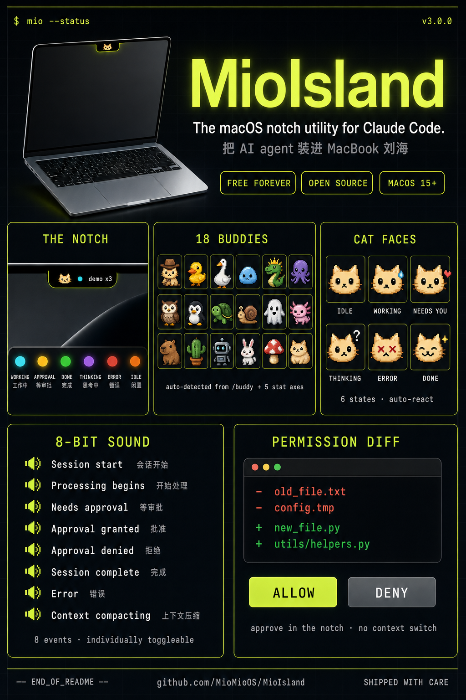
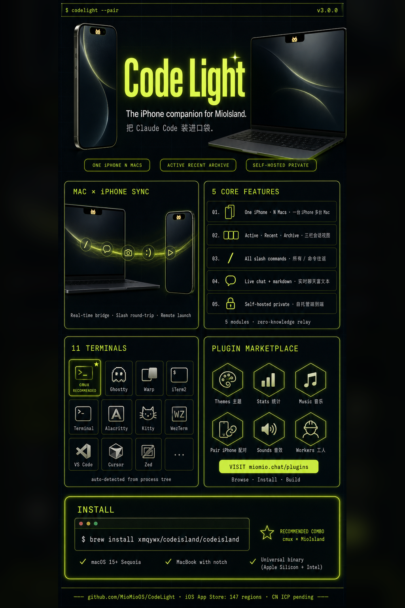

<div align="center">



# MioIsland

**Your AI agents live in the notch.**

[](https://github.com/MioMioOS/MioIsland/stargazers)

[](https://MioMioOS.github.io/MioIsland/)
[](https://github.com/MioMioOS/MioIsland/releases)
[](https://github.com/MioMioOS/MioIsland/releases)
[](LICENSE.md)

English | [中文](README.zh-CN.md)

A free, open-source passion project — no commercial intent, just trying to make Claude Code work better.

**If you find this useful, please give it a star ⭐ — it keeps us motivated to improve.**

</div>

---

## 🐱 What is MioIsland?

A **macOS notch utility** that turns your MacBook's camera notch into a **live Claude Code dashboard**. See what your AI agent is doing — status, project, active session count, even the buddy that comes with the session — right in your notch. Never tab back to check on Claude again.

The figure above shows everything that lives in the notch: six status colors, the session list, eighteen pixel buddies, six cat expressions, eight chiptune sounds, and in-notch permission approval with a diff preview.

---

## 📱 Code Light — your iPhone companion

<div align="center">



[](https://apps.apple.com/us/app/code-light/id6761744871)

> Available in 147 countries · China mainland pending ICP filing

</div>

> *Claude is thinking. You're at lunch. **You'll know.***

The same pixel cat that lives in your MacBook notch now lives in your iPhone's **Dynamic Island**. Real-time session phase, latest user message, Claude's reply preview — right on your lock screen.

The figure above shows: Mac × iPhone bidirectional sync (real-time status, slash-command round-trip, remote launch), five core features, eleven supported terminals, the Plugin Marketplace at [miomio.chat/plugins](https://miomio.chat/plugins), and the install command.

<details>
<summary><b>Code Light Sync — Technical Details (click to expand)</b></summary>

MioIsland's **sync module** is the bridge that makes the [Code Light](https://github.com/MioMioOS/CodeLight) iPhone companion possible. Open `Pair iPhone` from the notch menu to begin.

#### Pairing

Each Mac is identified by a **permanent 6-character `shortCode`** (lazy-allocated on first connect, never rotates). The pairing window shows both a QR code (scan with the iPhone) and the 6-character code (type it in). Both converge on `POST /v1/pairing/code/redeem`. Same code, unlimited iPhone pairs, never expires.

#### Phone → terminal routing

Phone messages have to land in the **exact** Claude Code terminal that the user picked. MioIsland's `TerminalWriter` does this with zero guessing:

1. `ps -Ax` to find the `claude --session-id <UUID>` process matching the message's session tag
2. `ps -E -p <pid>` to read `CMUX_WORKSPACE_ID` and `CMUX_SURFACE_ID` env vars
3. `cmux send --workspace <ws> --surface <surf> -- <text>`

If the live Claude PID was rotated by a `claude --resume`, a `cwd`-scoped fallback picks the highest-PID cmux-hosted Claude in the same directory. For non-cmux terminals, falls back to AppleScript.

#### Slash commands with captured output

`/model`, `/cost`, `/usage`, `/clear`, `/compact` don't write to Claude's JSONL. MioIsland intercepts these:

1. Snapshot the cmux pane via `cmux capture-pane`
2. Inject the slash command via `cmux send`
3. Poll the pane every 200 ms until output settles
4. Diff the snapshots and ship the new lines back as a synthetic `terminal_output` message

#### Remote session launch

The phone can ask MioIsland to spawn a new cmux workspace running a configured command:

```bash
cmux new-workspace --cwd <projectPath> --command "<preset.command>"
```

Default presets: `Claude (skip perms)`, `Claude + Chrome`.

#### Other features (briefly)

- **Image attachments** — Phone images come down as blob IDs, paste into the cmux pane via `NSPasteboard` + `Cmd+V` (requires Accessibility permission).
- **Project path sync** — `cwd` of every active session uploads every 5 min for the phone's "Recent Projects" picker.
- **Echo loop dedup** — 60s TTL `(claudeUuid, text)` ring prevents duplicate messages when phone-injected text echoes back through the JSONL watcher.
- **Multi-iPhone, multi-server** — One Mac pairs with N iPhones (same `shortCode`); one iPhone pairs with M Macs across different servers (per-Mac `serverUrl` switching).

</details>

> ⭐ **[Star MioIsland](https://github.com/MioMioOS/MioIsland)** + ⭐ **[Star Code Light](https://github.com/MioMioOS/CodeLight)** to stay updated.

---

## 📦 Install

### Homebrew (recommended)

```bash
brew install xmqywx/codeisland/codeisland
```

The cask handles Gatekeeper automatically — launch with a normal double-click right after install.

### Manual download

Grab the latest `.zip` from [Releases](https://github.com/MioMioOS/MioIsland/releases), unzip, drag `Mio Island.app` to `/Applications`.

MioIsland ships **unsigned**, so macOS Gatekeeper will block the first launch. Do **one** of:
- **Right-click** `Mio Island.app` → **Open** → click **Open** in the dialog
- Or run once in Terminal: `xattr -dr com.apple.quarantine "/Applications/Mio Island.app"`

### Requirements

- macOS 15+ (Sequoia) — universal binary (Apple Silicon + Intel)
- MacBook with notch (floating mode available on external displays)

### HTTP Proxy (for network-restricted regions)

`Settings → General → Anthropic API Proxy` routes MioIsland's Anthropic API traffic through a local HTTP proxy (e.g. `http://127.0.0.1:7890`). Useful with Clash / V2Ray.

**Applied to:** Notch rate-limit bar + **every subprocess MioIsland spawns** (Stats plugin's `claude` CLI, etc).
**Not applied to:** Code Light iPhone sync (`island.wdao.chat`), third-party plugins using their own `URLSession`.

Leave empty for direct connections.

<details>
<summary><b>Build from Source</b></summary>

```bash
git clone https://github.com/MioMioOS/MioIsland.git
cd MioIsland
xcodebuild -project ClaudeIsland.xcodeproj -scheme ClaudeIsland \
  -configuration Release CODE_SIGN_IDENTITY="-" \
  CODE_SIGNING_REQUIRED=NO CODE_SIGNING_ALLOWED=NO \
  DEVELOPMENT_TEAM="" build
```

</details>

---

## ⚙️ Settings

| Setting | Description |
|---|---|
| **Screen** | Choose which display shows the notch (Auto / Built-in / specific monitor) |
| **Notification Sound** | Select alert sound style |
| **Group by Project** | Flat list vs project-grouped sessions |
| **Pixel Cat Mode** | Pixel cat vs buddy emoji animation |
| **Language** | Auto (system) / English / 中文 |
| **Launch at Login** | Start MioIsland automatically |
| **Hooks** | Install/uninstall Claude Code hooks in `~/.claude/settings.json` |
| **Accessibility** | Grant accessibility permission for terminal focus + image-paste keystrokes |
| **Pair iPhone** | QR + 6-character pairing code for Code Light |
| **Launch Presets** | Manage cmux launch commands the iPhone can trigger remotely |

---

## 🔧 How It Works

1. **Zero config** — on first launch, MioIsland installs hooks into `~/.claude/settings.json`
2. **Hook events** — a Python script (`codeisland-state.py`) sends session state via Unix socket (`/tmp/codeisland.sock`)
3. **Permission approval** — for `PermissionRequest` events, socket stays open until you click Allow/Deny, then sends decision back to Claude Code
4. **Buddy data** — reads `~/.claude.json` for name/personality, runs `buddy-bones.js` with Bun for accurate species/rarity/stats
5. **Terminal jump** — AppleScript finds and focuses the correct terminal tab by matching working directory

---

## 🌍 i18n

English + 中文 with automatic system locale detection. Override in Settings → Language.

---

## 🤝 Contributing

Contributions welcome! I will personally review and merge all PRs.

1. **Bug?** [Open an issue](https://github.com/MioMioOS/MioIsland/issues) with steps to reproduce
2. **PR?** Fork → branch → make changes → open a PR
3. **Feature request?** Open an issue tagged `enhancement`

---

## 📬 Contact

Have questions or want to chat? Reach out!

- **Email**: xmqywx@gmail.com

    

---

## Credits

Forked from [Claude Island](https://github.com/farouqaldori/claude-island) by farouqaldori. Rebuilt with pixel cat animations, buddy integration, cmux support, i18n, and minimal glow-dot design.

## Star History

[](https://star-history.com/#MioMioOS/MioIsland&Date)

## License

CC BY-NC 4.0 — free for personal use, no commercial use.
